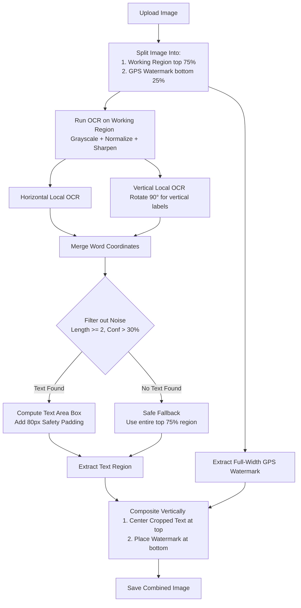

# Image Cropping Service (Testing Environment)

This directory contains the experimental code and cropped results for pre-processing vehicle images before sending them to the Mistral OCR engine.

## 📁 Directory Structure
* `crop.js` — Script using Tesseract.js & Sharp with **relaxed text boundaries** and **vertical GPS watermark composition**.
* `results/` — Cropped output images generated by `crop.js`.
* `run.log` — Log details of the latest processing run.

---

## 🛠️ How the Cropping Logic Works

To achieve near-100% reliability across stickers, direct metal engravings, and handwritten codes while preserving the full GPS watermark, the script executes the following pipeline:

1. **Working/Watermark Split:** The image is split into two regions: the working region (top 75%) and the GPS watermark region (bottom 25%).
2. **Contrast Normalization:** The working region is converted to grayscale, normalized, and sharpened to make faint text/markings stand out.
3. **Dual-Orientation OCR:** The script runs local WebAssembly-based Tesseract.js on the normal image and a 90-degree rotated version (relaxed detection parameters: word length $\ge 2$, confidence $> 30\%$).
4. **Text Region Crop:** If valid text is found, it extracts a padded box around it. If no text is found, it defaults to the full top 75% region.
5. **Vertical Composition:** The extracted text region (centered horizontally on a black background if narrower) is merged vertically with the **full-width GPS watermark** at the bottom.
6. **Output:** The combined image is saved directly to the `results/` folder.
